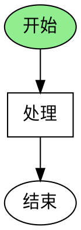

# PyQt6流程图实现完整指南

## 目录
1. [方案总览](#方案总览)
2. [安装说明](#安装说明)
3. [方案详解](#方案详解)
4. [使用示例](#使用示例)
5. [API参考](#API参考)
6. [最佳实践](#最佳实践)

---

## 方案总览

本项目提供了**三种**PyQt6流程图实现方案，每种方案都有其独特优势：

### 方案对比表

| 方案 | 文件 | 依赖库 | 优势 | 适用场景 |
|------|------|--------|------|----------|
| **方案1: PyQt6原生** | `flowchart_editor.py` | 仅PyQt6 | 完全控制、高度自定义、无额外依赖 | 需要完整流程图编辑器 |
| **方案2: Graphviz集成** | `flowchart_graphviz.py` | PyQt6 + graphviz | 自动布局、专业渲染 | 自动生成和展示流程图 |
| **方案3: PyQtGraph集成** | `flowchart_pyqtgraph.py` | PyQt6 + pyqtgraph | 数据流可视化、高性能 | 数据处理流程图 |

---

## 安装说明

### 基础安装（所有方案需要）

```bash
pip install PyQt6
```

### 方案1：PyQt6原生（推荐初学者）

**无需额外安装**，只需安装PyQt6即可。

```bash
# 运行
python flowchart_editor.py
```

### 方案2：Graphviz集成

需要安装Python库和系统Graphviz：

```bash
# 1. 安装Python库
pip install graphviz

# 2. 安装系统Graphviz
# Ubuntu/Debian:
sudo apt install graphviz

# macOS:
brew install graphviz

# Windows:
# 从 https://graphviz.org/download/ 下载安装
# 并将bin目录添加到PATH环境变量

# 3. 运行
python flowchart_graphviz.py
```

### 方案3：PyQtGraph集成

```bash
# 安装
pip install pyqtgraph

# 运行
python flowchart_pyqtgraph.py
```

---

## 方案详解

### 方案1：PyQt6原生流程图编辑器（推荐）

**文件：`flowchart_editor.py`**

#### 特性

1. **完整的节点类型**
   - Set Signal（设置信号）- 圆角矩形，绿色
   - Check Signal（检查信号）- 菱形，蓝色
   - Wait（等待延迟）- 平行四边形，黄色
   - Timeout（超时控制）- 六边形，橙色
   - Duration（持续检测）- 双线矩形，紫色
   - Async Task（异步任务）- 圆柱体，青色
   - Decision（判断）- 菱形，灰色
   - Start/End（开始/结束）- 椭圆，深灰色

2. **交互功能**
   - 拖拽节点移动
   - 点击选中节点（红色虚线边框）
   - 连接节点（点击工具栏"连接节点"按钮）
   - 右键菜单（删除、编辑）
   - 缩放视图（放大/缩小）
   - 清空画布

3. **连接线类型**
   - 普通流程：黑色实线
   - 超时触发：红色虚线
   - 异步调用：蓝色粗线
   - 循环返回：灰色点线

#### 使用步骤

```python
# 1. 启动程序
python flowchart_editor.py

# 2. 使用左侧工具箱添加节点
#    点击按钮会在画布上创建节点

# 3. 连接节点
#    - 点击工具栏"连接节点"按钮
#    - 依次点击起始节点和目标节点
#    - 自动创建连接线

# 4. 移动节点
#    - 直接拖拽节点到目标位置
#    - 连接线会自动更新

# 5. 删除节点
#    - 右键点击节点
#    - 选择"删除节点"
```

#### 代码示例：自定义添加节点

```python
from flowchart_editor import FlowchartEditor, SetSignalNode, CheckSignalNode

app = QApplication(sys.argv)
editor = FlowchartEditor()

# 添加自定义节点
set_node = SetSignalNode(300, 200)
editor.scene.addItem(set_node)

check_node = CheckSignalNode(300, 350)
editor.scene.addItem(check_node)

editor.show()
app.exec()
```

#### 自定义节点形状

```python
from flowchart_editor import FlowchartNode

class CustomNode(FlowchartNode):
    """自定义节点"""
    def __init__(self, x, y):
        super().__init__("CUSTOM", "我的节点", x, y)
    
    def _draw_shape(self, painter):
        # 绘制自定义形状
        rect = self.boundingRect()
        painter.drawRect(rect)  # 矩形
        # 或者绘制其他形状...
```

---

### 方案2：Graphviz自动布局

**文件：`flowchart_graphviz.py`**

#### 特性

1. **自动布局算法**
   - DOT：层次化布局（默认）
   - Neato：弹簧布局
   - FDP：力导向布局
   - Circo：环形布局

2. **DOT语言编辑**
   - 左侧代码编辑器
   - 实时渲染预览
   - SVG矢量图输出

3. **内置示例**
   - 示例1：基础信号检测流程
   - 示例2：持续检测流程
   - 示例3：异步并行流程

#### 使用步骤

```python
# 1. 启动程序
python flowchart_graphviz.py

# 2. 点击示例按钮加载示例代码

# 3. 在左侧编辑器中修改DOT代码

# 4. 点击"渲染流程图"查看结果
```

#### DOT语言示例



#### 节点形状参考

| Shape | 说明 | 适用 |
|-------|------|------|
| `ellipse` | 椭圆 | Start/End |
| `box` | 矩形 | 一般处理 |
| `diamond` | 菱形 | 判断/检查 |
| `parallelogram` | 平行四边形 | 输入/输出 |
| `hexagon` | 六边形 | 控制器 |
| `cylinder` | 圆柱 | 数据库/任务 |

#### 样式参考

```dot
node [
    style=filled,           // 填充
    fillcolor="#90EE90",   // 填充色
    fontcolor=white,       // 文字颜色
    fontname="Arial",      // 字体
    peripheries=2          // 双边框
];

edge [
    style=dashed,          // 虚线
    color=red,            // 颜色
    label="标签"           // 标签文字
];
```

---

### 方案3：PyQtGraph数据流图

**文件：`flowchart_pyqtgraph.py`**

#### 特性

1. **数据流节点**
   - Input（输入）
   - Function（函数处理）
   - Filter（过滤器）
   - Delay（延迟）
   - Output（输出）

2. **实时数据处理**
   - 节点参数可编辑
   - 数据流实时传递
   - 适合科学计算可视化

3. **高性能**
   - 基于OpenGL加速
   - 适合大规模节点

#### 使用步骤

```python
# 1. 启动程序
python flowchart_pyqtgraph.py

# 2. 点击示例按钮查看不同流程

# 3. 拖动节点调整位置

# 4. 点击节点查看/编辑参数
```

#### 编程示例

```python
import pyqtgraph as pg
from pyqtgraph.Qt import QtGui

# 创建flowchart
fc = pg.flowchart.Flowchart(terminals={})

# 添加节点
input_node = fc.createNode('Input', pos=(0, 0))
process_node = fc.createNode('Function', pos=(150, 0))
output_node = fc.createNode('Output', pos=(300, 0))

# 连接节点
fc.connectTerminals(input_node['dataOut'], process_node['dataIn'])
fc.connectTerminals(process_node['dataOut'], output_node['dataIn'])

# 显示
fc.widget().show()
```

---

## 使用示例

### 示例1：创建基础信号检测流程

使用**方案1（PyQt6原生）**：

```python
from flowchart_editor import *

app = QApplication(sys.argv)
editor = FlowchartEditor()

# 创建流程
start = StartEndNode(200, 100, "开始")
set_signal = SetSignalNode(200, 200)
check = CheckSignalNode(200, 300)
end = StartEndNode(200, 400, "结束")

# 添加到场景
for node in [start, set_signal, check, end]:
    editor.scene.addItem(node)

# 创建连接
editor.scene.addItem(ConnectionLine(start, set_signal))
editor.scene.addItem(ConnectionLine(set_signal, check))
editor.scene.addItem(ConnectionLine(check, end))

editor.show()
sys.exit(app.exec())
```

### 示例2：带超时的异步检测

```python
# 主流程节点
start = StartEndNode(300, 100, "开始")
async_task = AsyncTaskNode(300, 200)
timeout = TimeoutNode(500, 200)
check = CheckSignalNode(300, 300)
decision = DecisionNode(300, 400)
success = StartEndNode(200, 500, "成功")
fail = StartEndNode(400, 500, "失败")

# 添加节点
nodes = [start, async_task, timeout, check, decision, success, fail]
for node in nodes:
    editor.scene.addItem(node)

# 创建连接
editor.scene.addItem(ConnectionLine(start, async_task))
editor.scene.addItem(ConnectionLine(async_task, check, "async"))
editor.scene.addItem(ConnectionLine(timeout, check, "timeout"))
editor.scene.addItem(ConnectionLine(check, decision))
editor.scene.addItem(ConnectionLine(decision, success))
editor.scene.addItem(ConnectionLine(decision, fail))
```

### 示例3：使用Graphviz生成复杂流程

```python
from flowchart_graphviz import *

app = QApplication(sys.argv)
viewer = GraphvizFlowchartViewer()

# 自定义DOT代码
dot_code = """
digraph ComplexFlow {
    rankdir=LR;  // 从左到右
    
    subgraph cluster_0 {
        label="初始化阶段";
        style=filled;
        fillcolor=lightgrey;
        
        init [label="初始化"];
        config [label="配置"];
    }
    
    subgraph cluster_1 {
        label="执行阶段";
        style=filled;
        fillcolor=lightblue;
        
        execute [label="执行"];
        check [label="检查"];
    }
    
    init -> config -> execute -> check;
}
"""

viewer.code_editor.setText(dot_code)
viewer.render_flowchart()
viewer.show()

sys.exit(app.exec())
```

---

## API参考

### FlowchartNode类（方案1）

#### 构造函数
```python
FlowchartNode(node_type, text, x, y, width=120, height=60)
```

**参数：**
- `node_type`: 节点类型（字符串）
- `text`: 显示文本
- `x, y`: 位置坐标
- `width, height`: 节点尺寸

#### 主要方法
```python
# 获取节点中心点
center = node.get_center()

# 添加连接
node.add_connection(connection)

# 自定义形状绘制（子类重写）
def _draw_shape(self, painter):
    # 绘制代码
    pass
```

### ConnectionLine类（方案1）

#### 构造函数
```python
ConnectionLine(start_node, end_node, line_type="normal")
```

**参数：**
- `start_node`: 起始节点
- `end_node`: 目标节点
- `line_type`: 线型 ("normal", "timeout", "async", "loop")

#### 方法
```python
# 更新连接线位置
connection.update_position()
```

### FlowchartScene类（方案1）

#### 方法
```python
# 开始连接模式
scene.start_connection()

# 清空场景
scene.clear()
```

---

## 最佳实践

### 1. 选择合适的方案

**使用方案1（PyQt6原生）如果：**
- 需要完全自定义的流程图编辑器
- 需要丰富的交互功能
- 希望用户能编辑流程图
- 不想依赖第三方库

**使用方案2（Graphviz）如果：**
- 需要自动布局
- 主要用于展示而非编辑
- 从代码或数据自动生成流程图
- 需要专业的图形渲染

**使用方案3（PyQtGraph）如果：**
- 处理数据流和数据管道
- 需要高性能（大量节点）
- 进行科学计算可视化
- 需要实时数据处理

### 2. 性能优化

```python
# 方案1：大量节点时禁用抗锯齿
view.setRenderHint(QPainter.RenderHint.Antialiasing, False)

# 使用缓存模式
node.setCacheMode(QGraphicsItem.CacheMode.DeviceCoordinateCache)

# 设置合理的场景范围
scene.setSceneRect(0, 0, 2000, 2000)
```

### 3. 自定义样式

```python
# 修改节点颜色
node.colors[NodeType.SET_SIGNAL] = QColor(100, 200, 100)

# 修改连接线样式
pen = QPen(QColor(255, 0, 0), 3, Qt.PenStyle.DashDotLine)
connection.setPen(pen)

# 设置背景
scene.setBackgroundBrush(QBrush(QColor(240, 240, 240)))
```

### 4. 保存和加载

```python
# 保存流程图为图片（方案1）
from PyQt6.QtGui import QImage, QPainter

image = QImage(scene.sceneRect().size().toSize(), 
               QImage.Format.Format_ARGB32)
painter = QPainter(image)
scene.render(painter)
painter.end()
image.save("flowchart.png")

# 保存为SVG（方案2 Graphviz）
graph = graphviz.Source(dot_code)
graph.render('flowchart', format='svg')
```

### 5. 导出流程数据

```python
# 导出节点和连接数据（方案1）
def export_flowchart_data(scene):
    data = {
        'nodes': [],
        'connections': []
    }
    
    for item in scene.items():
        if isinstance(item, FlowchartNode):
            data['nodes'].append({
                'type': item.node_type,
                'text': item.text,
                'x': item.x(),
                'y': item.y()
            })
        elif isinstance(item, ConnectionLine):
            data['connections'].append({
                'start': id(item.start_node),
                'end': id(item.end_node),
                'type': item.line_type
            })
    
    return data

# 使用
import json
data = export_flowchart_data(editor.scene)
with open('flowchart.json', 'w') as f:
    json.dump(data, f, indent=2)
```

---

## 常见问题

### Q1: 如何修改节点大小？

```python
# 创建节点时指定
node = SetSignalNode(100, 100)
node.width = 150
node.height = 80
```

### Q2: 如何添加文本标签到连接线？

```python
class LabeledConnectionLine(ConnectionLine):
    def __init__(self, start_node, end_node, label=""):
        super().__init__(start_node, end_node)
        self.label = label
    
    def paint(self, painter, option, widget):
        super().paint(painter, option, widget)
        # 在线的中点绘制文本
        line = self.line()
        mid_point = line.center()
        painter.drawText(mid_point, self.label)
```

### Q3: 如何实现节点的撤销/重做？

使用QUndoStack：

```python
from PyQt6.QtGui import QUndoStack, QUndoCommand

class AddNodeCommand(QUndoCommand):
    def __init__(self, scene, node):
        super().__init__()
        self.scene = scene
        self.node = node
    
    def undo(self):
        self.scene.removeItem(self.node)
    
    def redo(self):
        self.scene.addItem(self.node)

# 在编辑器中使用
self.undo_stack = QUndoStack()
command = AddNodeCommand(self.scene, node)
self.undo_stack.push(command)
```

### Q4: Graphviz在Windows上找不到？

确保：
1. 已从官网下载并安装Graphviz
2. 将Graphviz的bin目录添加到PATH环境变量
3. 重启命令行或IDE

```python
# 或在代码中指定路径
import os
os.environ["PATH"] += os.pathsep + 'C:/Program Files/Graphviz/bin'
```

---

## 扩展资源

### 文档链接
- [PyQt6官方文档](https://www.riverbankcomputing.com/static/Docs/PyQt6/)
- [Graphviz文档](https://graphviz.org/documentation/)
- [PyQtGraph文档](https://pyqtgraph.readthedocs.io/)

### 相关文件
- `signal_flow_architecture.md` - 架构设计文档
- `signal_flow_diagrams.md` - Mermaid图表
- `signal_flow_drawio_design.md` - Draw.io风格设计

---

## 总结

本项目提供了三种完整的PyQt6流程图解决方案：

1. **PyQt6原生**：最灵活，适合完整编辑器
2. **Graphviz**：最专业，适合自动生成
3. **PyQtGraph**：最高效，适合数据流

选择适合您需求的方案，开始创建专业的流程图应用！
