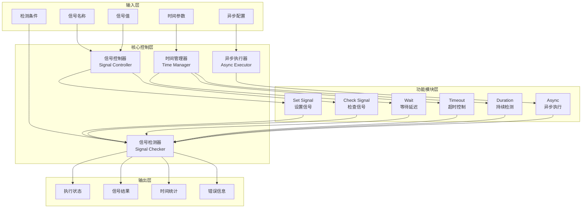
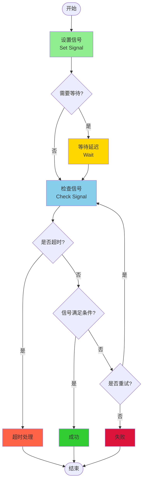
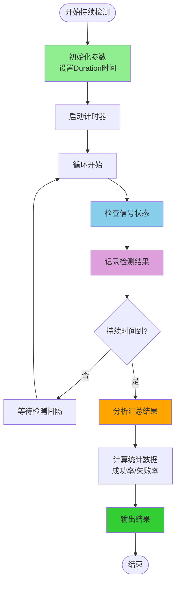
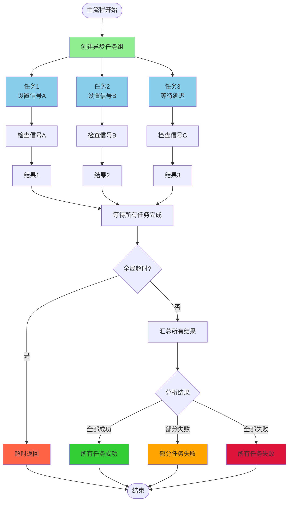
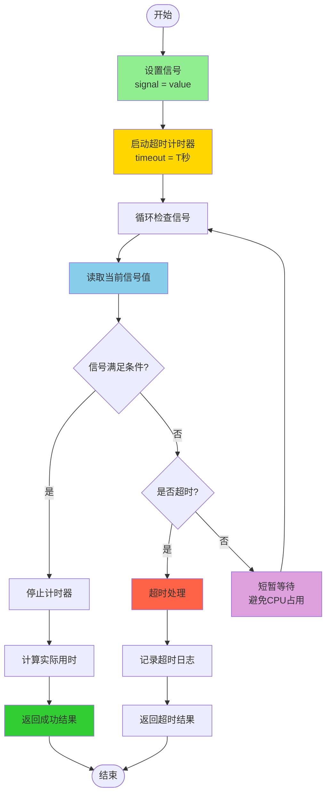
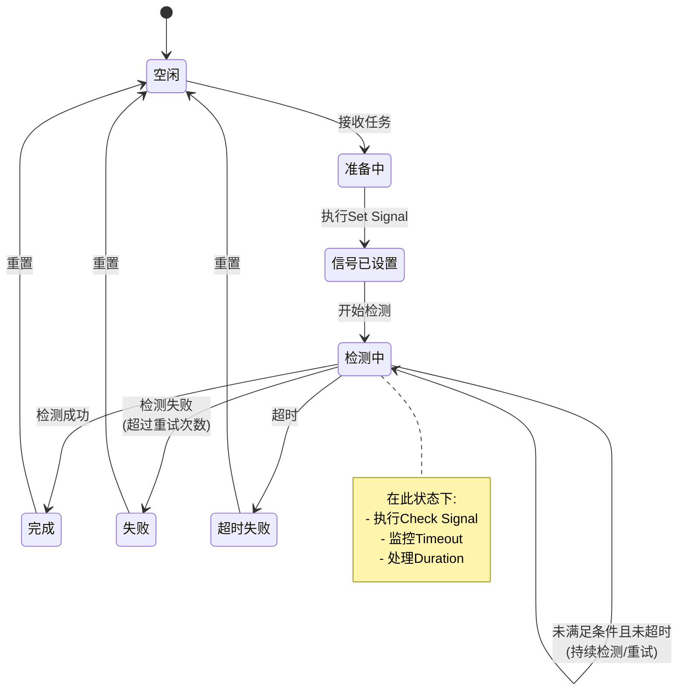
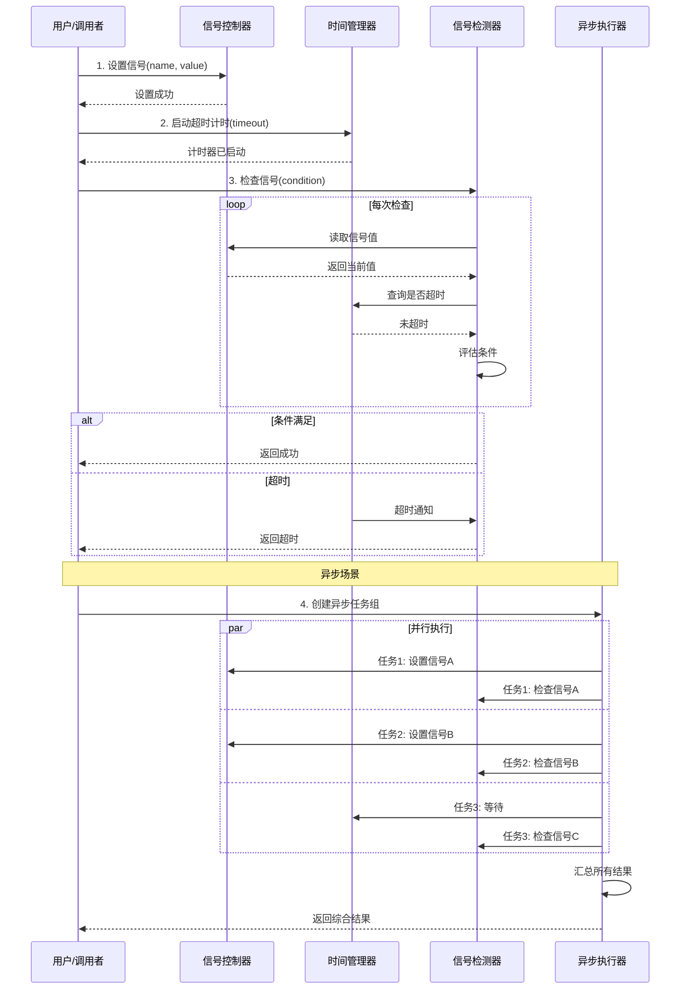
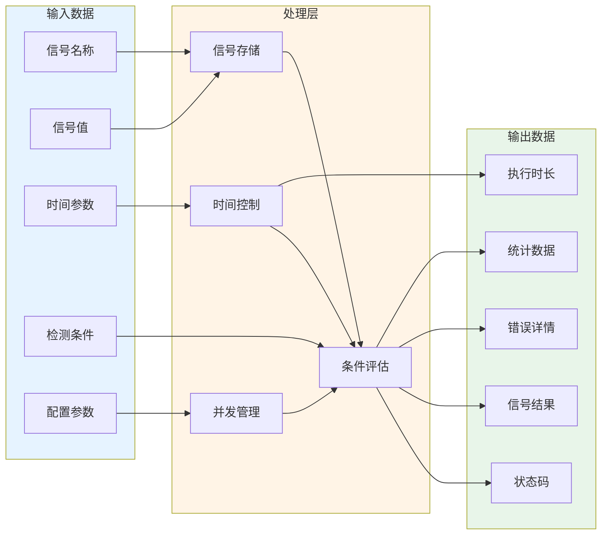
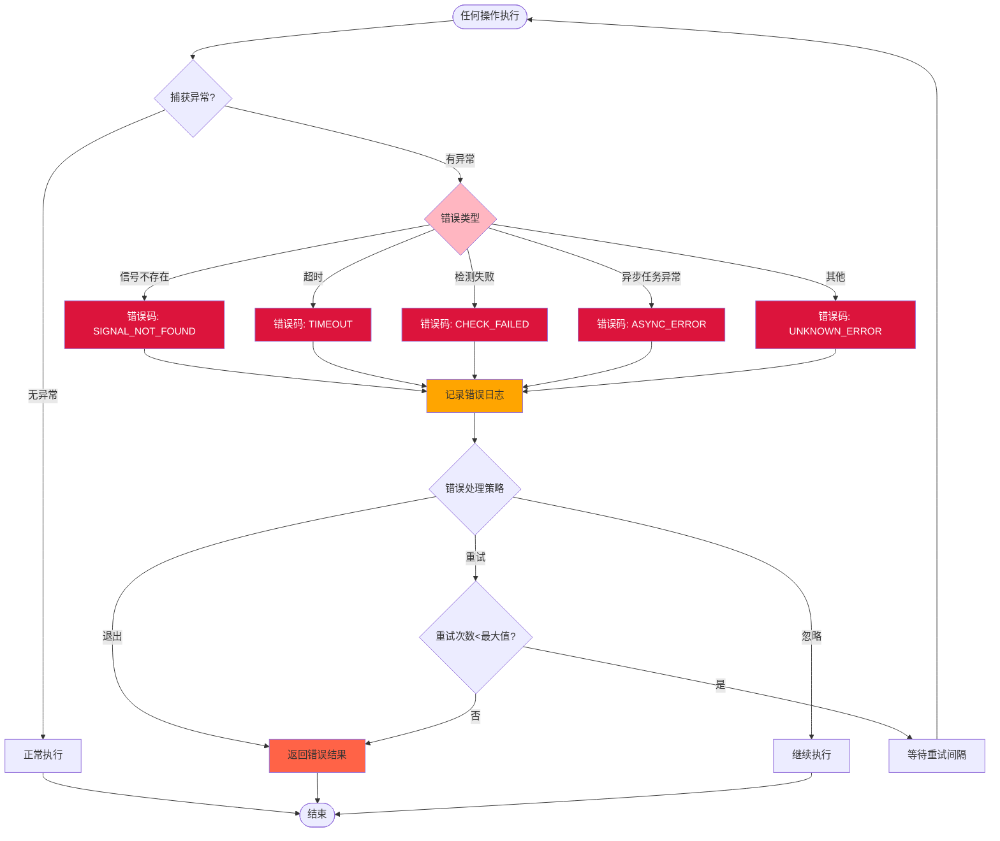
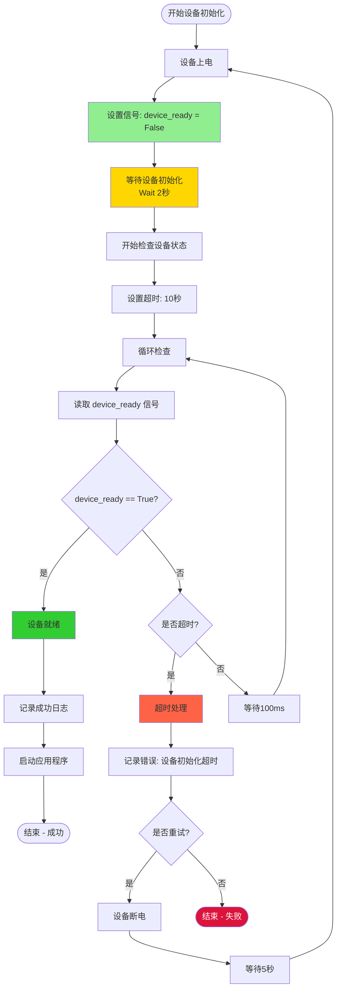

# 信号流程控制可视化图表

## 1. 整体架构图

## 2. 基础信号检测流程

## 3. 持续检测流程（Duration）

## 4. 异步并行执行流程（Async）

## 5. 带超时的信号检测详细流程

## 6. 状态机图

## 7. 组件交互时序图

## 8. 数据流图

## 9. 错误处理流程

## 10. 典型应用示例：设备就绪检测

## 使用说明

这些图表使用Mermaid语法编写，可以在以下环境中查看：
1. GitHub/GitLab的Markdown文件中直接渲染
2. VS Code安装Mermaid插件
3. 在线工具：https://mermaid.live/
4. 其他支持Mermaid的Markdown编辑器

每个图表展示了不同的架构视角和应用场景，您可以根据实际需求选择合适的模式进行实现。
